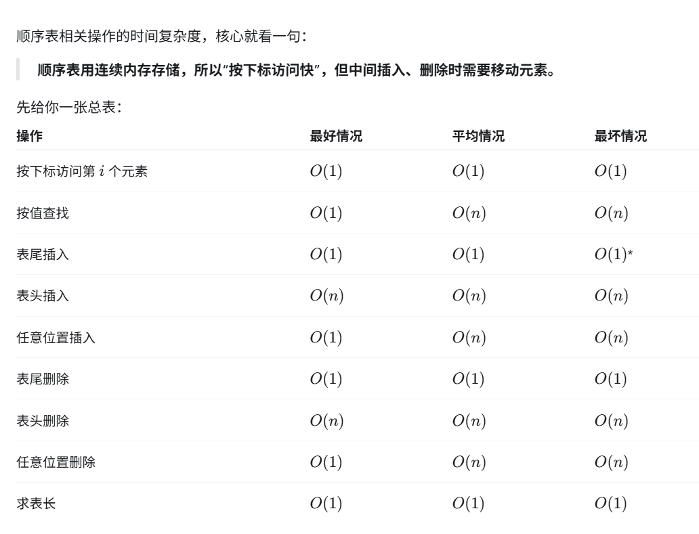

# 顺序表常见操作时间复杂度



# C++ 类模板

## 1. 定义类模板

```cpp
template <class T>
class SeqList {
private:
    T* array;
    int len;
    int maxLen;

public:
    SeqList(int size);
    ~SeqList();

    T getElem(int i) const;
};
```

`T` 表示暂时不确定的数据类型。

也可以写成：

```cpp
template <typename T>
```

---

## 2. 实例化类模板

```cpp
SeqList<int> a(100);
SeqList<double> b(50);
SeqList<char> c(20);
```

表示：

- `T = int`
- `T = double`
- `T = char`

---

## 3. 类外实现成员函数

基本格式：

```cpp
template <class T>
返回类型 SeqList<T>::函数名(...)
{
}
```

例如：

```cpp
template <class T>
T SeqList<T>::getElem(int i) const
{
    return array[i];
}
```

---

## 4. 构造函数

```cpp
template <class T>
SeqList<T>::SeqList(int size)
{
    array = new T[size];
    maxLen = size;
    len = 0;
}
```

---

## 5. 析构函数

```cpp
template <class T>
SeqList<T>::~SeqList()
{
    delete[] array;
}
```

---

## 6. 模板类文件组织

类模板一般把声明和实现都写在 `.h` 文件中。

推荐结构：

```text
SeqList.h
main.cpp
```

`main.cpp` 中使用：

```cpp
#include "SeqList.h"
```

---

## 7. 重点记忆

- 定义模板：`template <class T>`
- 实例化：`SeqList<int>`
- 类外实现：`SeqList<T>::函数名`
- 动态数组：`new T[size]`
- 释放动态数组：`delete[] array`